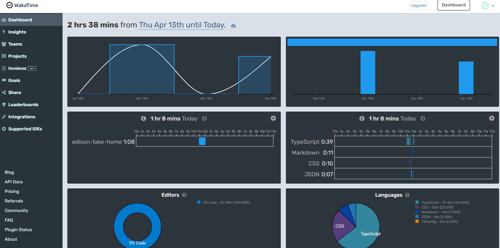

# Edison Demo

This is a basic web app created using React and typescript. Here is a link where you can view the result: https://master.dd0xlfw2wwd0.amplifyapp.com/

This project was created to showcase a few pieces of functionality. In particular:

- Dynamic sizing depending on screen size (mobile vs computer)
- Pagination of elements as user scrolls
- Interactive elements (clickable cards, interactive buttons)
- Making a call to an API

## Running the project locally

If you would like the run the website on your own machine:

1. make sure you have node.js installed
2. clone the repo
3. run `npm install` to install all dependencies (node_modules)

Then, in the project directory, you can run:

### `npm start`

Runs the app in the development mode.\
Open [http://localhost:3000](http://localhost:3000) to view it in the browser.

### Time spent

Below you can see a breakdown of the time it took me to complete this:

